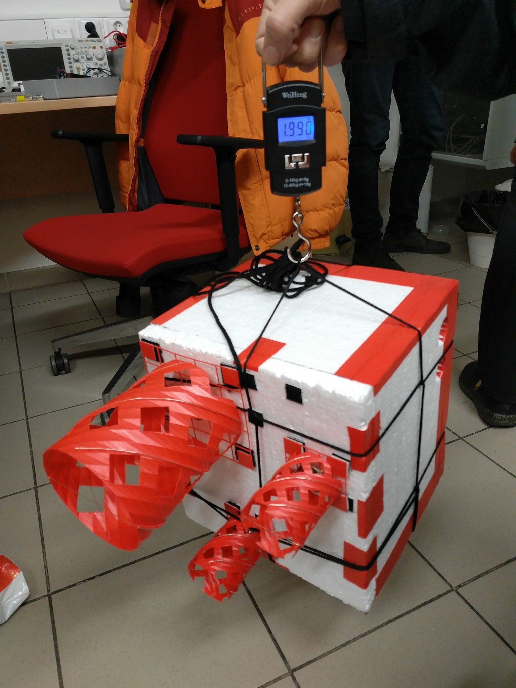
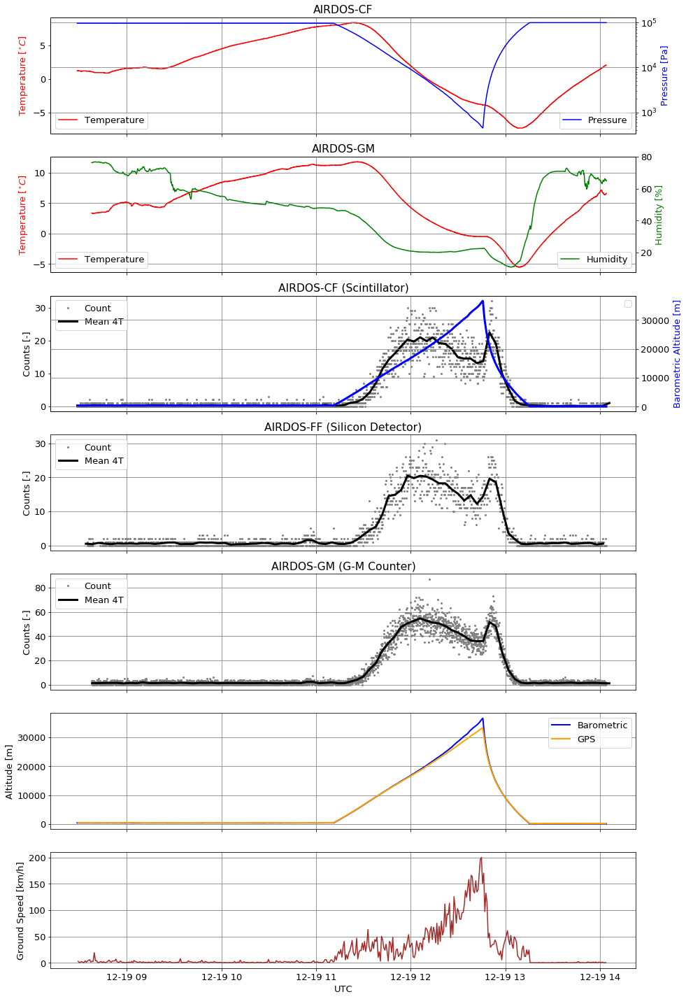

# FIK-9 - High-altitude balloon dosimetry experiment

[Department of Radiation Dosimetry of the Nuclear Physics Institute of the Czech Academy of Sciences](http://www.ujf.cas.cz/en/departments/department-of-radiation-dosimetry/contact/) high-altitude balloon experiment

### Scientific payload

  * Iontometer
  * AIRDOS dosimeters

### Supporting instruments

  * Relative humidity sensor
  * Temperature sensor
  * Precise barometer
  * Spheric (360 deg) camera

### Design features

  * Redundant telemetry link
  * Gondola orientation tracking and logging
  * Reliable IMU sensor processing and calibration
  * Possible of use relatively high-power payloads
  * Pre-flight continuous charging possible
  * Power monitoring and maximal uptime calculation relevant to actual temperature

### Flight data

 A more detailed description of the flight and discussion of the experiment is included in [EURADOS presentation](doc/FIK-6_EURADOS_presentation.pdf)

### Links

  * [Facebook](https://www.facebook.com/balonfik/)
