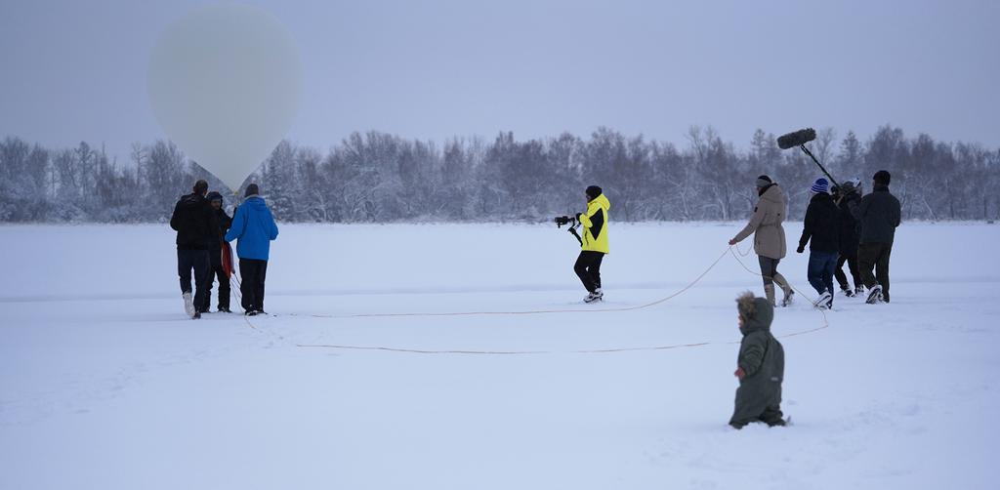
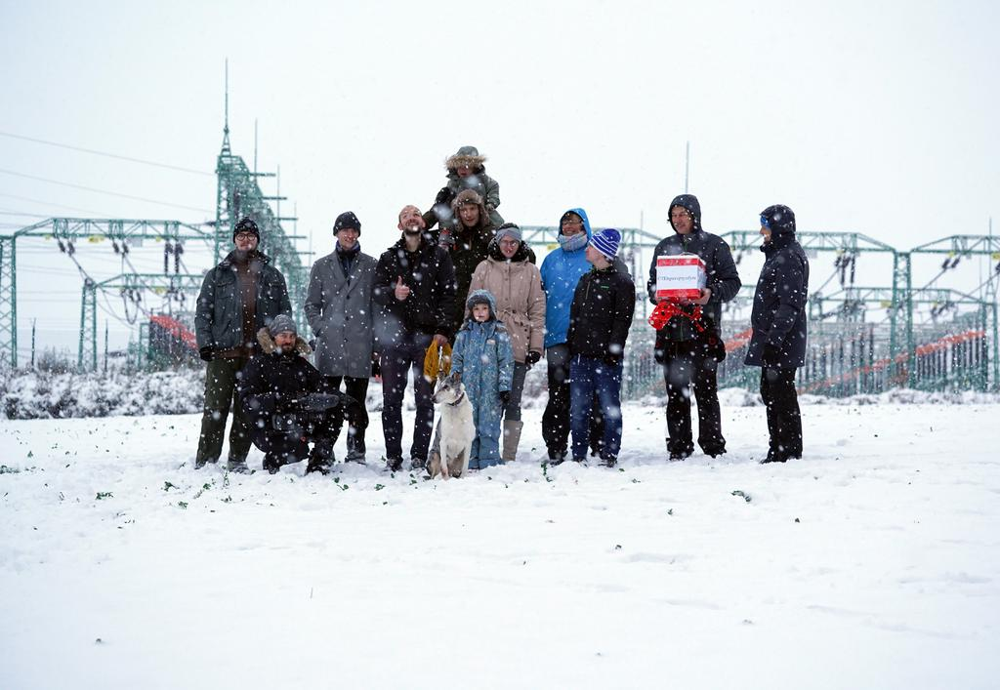
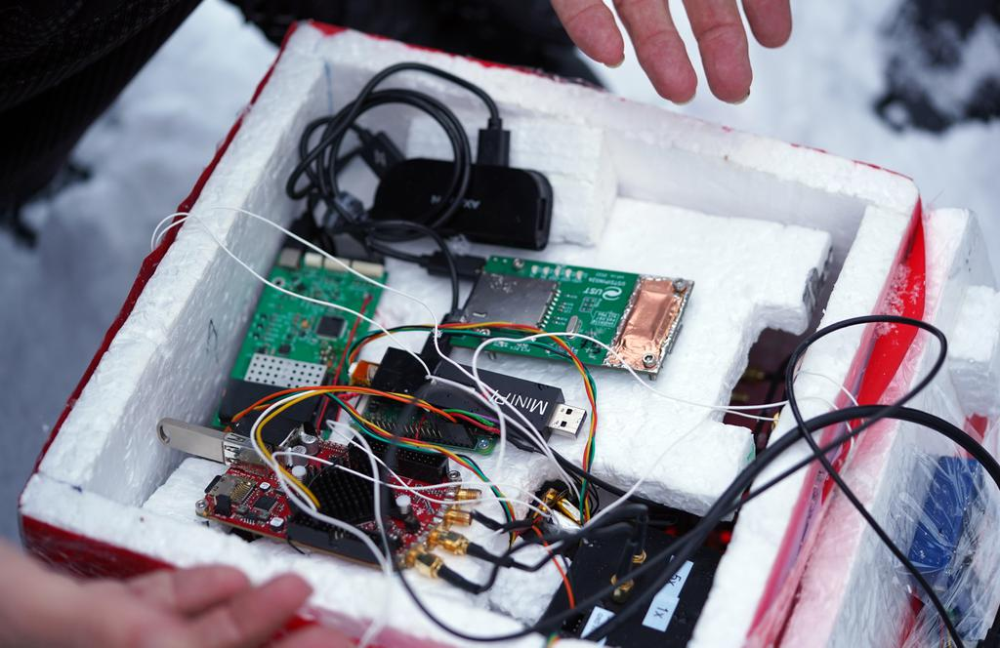
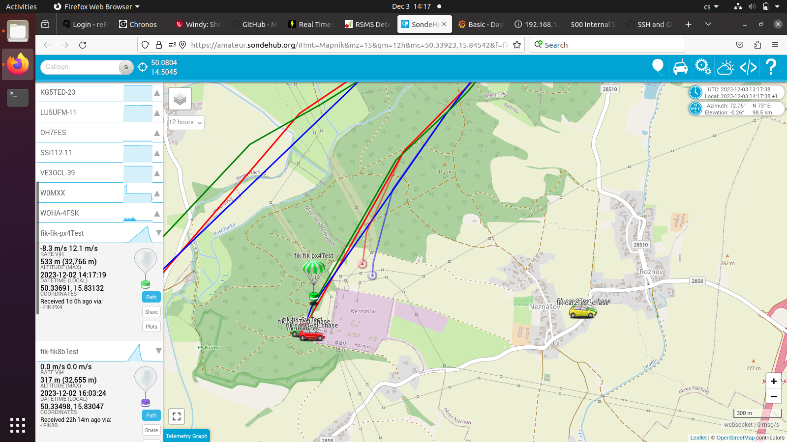

# FIK-9 - High-altitude balloon dosimetry experiment

[Department of Radiation Dosimetry of the Nuclear Physics Institute of the Czech Academy of Sciences](http://www.ujf.cas.cz/en/departments/department-of-radiation-dosimetry/contact/) high-altitude balloon experiment

### Repo TODO for documenting
- [ ] Block diagram update
- [ ] Correct submodule version PX4Firmware FMUv5
- [ ] Link to the used one-way Sik Modem Firmware 
- [ ] Ground Software description
- [ ] Rescue cars Software description
- [ ] Standalone tracking device FW
- [ ] Payload FW and scripts

### Used Scientific payload

 - [AIRDOS04](https://github.com/UniversalScientificTechnologies/AIRDOS04) Prototype
 - [LABDOS01B](https://github.com/UniversalScientificTechnologies/LABDOS01)
 - [LABDOS01B](https://github.com/UniversalScientificTechnologies/LABDOS01/tree/LABDOS01A)
 - PiTED?
 - MiniPIX
 -

### The used experiment support devices and technologies

 - [ ] CUAV V5+ FMUv5 with PX4 Firmware
   - [ ] 433 MHz Sik telemetry (one-way TX only)
   - [ ] 868 MHz Lora Telemetry (TX only)
   - [ ] TFHT01 Temperature and humidity sensors
   - [ ] TF-ATMON Logging of data from the payload
 - [ ] Standalone tracking device

### Design features

  * Redundant telemetry link
  * Gondola orientation tracking and logging
  * Reliable IMU sensor processing and calibration
  * Possible of use relatively high-power payloads
  * Pre-flight continuous charging possible
  * Power monitoring and maximal uptime calculation relevant to actual temperature

### Flight data

### Links
  * [Facebook](https://www.facebook.com/balonfik/)
